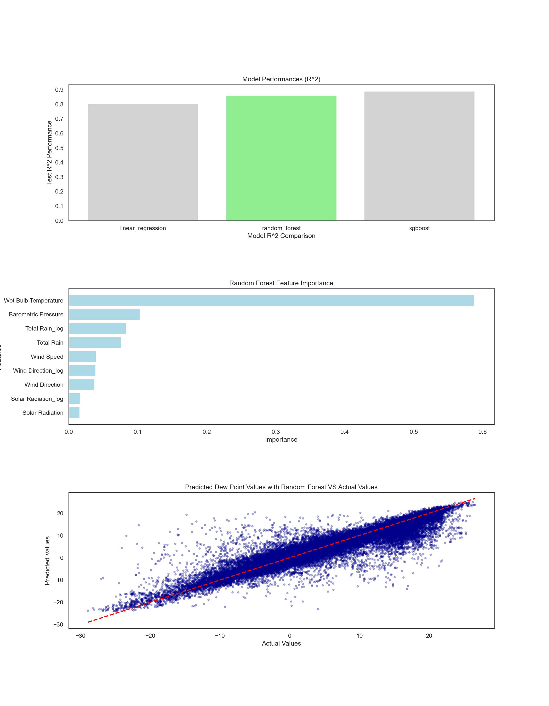

# Chicago Beach Weather Sensor Analysis
*by Jack Neary*

## Executive Summary
The dataset being analyzed is the Chicago Weather Sensor Dataset. This has roughly 10 years of data from 3 different weather sensors across Chicago, and measures various meteorological metrics over time. The main goal going into this was to use the raw data to develop a metric relevant to public safety. The dew point temperature is important to track because this is the point at which the air becomes foggy depending on the air temperature and the humidity percentage. Predicting foggy conditions would provide valuable information to Chicago citizens, helping them better prepare for driving and other activities in potentially hazardous weather conditions. After testing different models, it was found that using a random forest model to predict dew point yields a strong predictive performance.

## Phase-by-Phase Findings

### Phase 1-2: Exploration

In this phase, the initial data inspection was performed. Here are some findings:
- The original dataset had 196,138 rows
- Columns with 75,859 missing values
    - Wet Bulb Temperature
    - Rain Intensity
    - Total Rain
    - Precipitation Type
    - Heading
- Other rows had very minimal missing values < 5% of all data
    - Air Temperature
    - Barometric Pressure

**Visualizations for data exploration:**

- `Humidity` histogram
    - Normal distribution
- `Air Temperature` histogram
    - Normal distribution
- `Air Temperature` line plot over time
    - Obvious seasonal pattern shown

From here, the data to be used for the dew point calculation look good. Moving onto the cleaning process. 

### Phase 3: Data Cleaning

The goal of the cleaning section was to have consistent data types, handle missing values, and correct for outliers.

**Data types:**
- `Measurement Timestamp` converted to datetime
- `Precipitation Type` is a categorical variable, converted to 0-3 and if necessary would be handled as a categorical variable in the modeling stage

**Handling missing data:**
- Missing data was handled differently depending on the proportion missing in each column
    - The columns mentioned above with 75,859 missing values were forward filled using the previous, non-missing, observation.
    - Barometric Pressure and Air Temperature had so few missing records so the the decision was made to drop these rows outright, which is valid on columns with <5% of the values missing.
- This strategy preserved the time series structure while retaining valid data for the analysis.

**Handling and removing outliers:**
- Several variables contained unrealistic values that were corrected using upper and lower bounds based on meteorological reasoning:
    - `Rain Intensity` was clipped to a minimum of 0 and a maximum of 5.
    - `Interval Rain` was clipped between 0 and 25.
    - `Solar Radiation` was clipped between 0 and 1100.
    - `Wind Speed` was clipped between 0 and 18.
    - `Maximum Wind Speed` was clipped between 0 and 24.
    - `Barometric Pressure` was clipped between 800 and 1050.
- This ensured that all values used in modeling remained within realistic environmental limits.

### Phase 4: Data Wrangling 

After cleaning the data, temporal information were extracted using the `Measurement Timestamp`, supporting time series data analysis. Since weather data is time dependent and seasonal, it is a good idea to look at such predictors over time windows to see their characteristics and trends.

These temporal features were created using the `Measurement Timestamp` column:
 - `hour`: hour of the day (0-23)
 - `day_of_week`: numeric day (0-6)
 - `month`: numeric month
 - `year`: numeric year
 - `day_name`: Monday - Sunday
 - `is_weekend`: binary variable indicating weekend (0,1)

Additionally, the overall datetime range was also summarized by using the earliest and latest Measurement Timestamp records to find the total duration of this dataset. 

### Phase 5: Feature Engineering

Building on the cleaned data and temporal features, new features were created to use as predictors in the upcoming models. These features were designed to summarize trends over time, reduce skewness in the data, and create new trackable metrics that are not apparent in the raw measurements:
- `dew_point`: using the Magnus-Tetens formula we can use Air Temperature and Humidity, along with formula constants, to calculate the temperature where air becomes saturated with water vapor and condensation begins, which causes fog.
- `gust_factor`: dividing the Maximum Wind Speed by the median Wind Speed, this calculates how much stronger the maximum wind is compared to the typical wind, indicating the intensity of gusts compared to normal conditions.
- rolling calculations:
    - `barometric_pressure_rolling_7h`
    - `barometric_pressure_rolling_12h`
    - `humidity_rolling_12h`
    - `humidity_rolling_24h`
      These features summarize changes over time windows to detect shifts in barometric pressure or humidity that may affect weather conditions.
- log transformations were applied to all skewed columns to reduce right skewness and potentially improve model performance.
- log transformations:
  - `Rain Intensity_log`
  - `Interval Rain_log`
  - `Total Rain_log`
  - `Wind Direction_log`
  - `Maximum Wind Speed_log`
  - `Solar Radiation_log`

     - log transformations were applied to all skewed columns to reduce right skewness and potentially improve model performance.
     - Both original and log transformation columns were kept to not lose out on any predictor variables. After the log variables were created, the mean and median were checked to confirm that distribution was fixed.

### Phase 6: Pattern Analysis

Feature engineering visuals

- Calculating the pearson coefficient (R) for each variable and visualizing the variables against themselves, we can see which variables have strong, or weak, correlations with each other and make a decision to pick with predictors will be used in the models. 

Patterns Identified

- Temporal Trends:
    - `Air Temperature`: higher on average in summer months, lower in winter  
    - `Humidity`: higher on average in summer months, lower in winter  
    - `Dew Point`: higher on average in summer and fall, lower in winter and early spring

- Correlations:
- `dew_point` has a very high positive correlation with `Wet Bulb Temperature`: r = 0.79  
- `Wet Bulb Temperature` has a high positive correlation with `Air Temperature` r = 0.79  
- `Gust Factor` has a moderate positive correlation with `Wind Direction`: r = 0.42  
- `Precipitation Type` has a moderate positive correlation with `Rain Intensity`: r = 0.55  

These patterns informed feature selection and helped identify which predictors are most relevant for modeling dew point and understanding weather trends.

### Phase 7: Modeling Preparation
The target variable for modeling was set to `dew_point`, as predicting this metric is the main focus of the analysis.

**Feature Selection:**  
- Excluded columns that could cause data leakage or are non-predictive:  
  - `dew_point` (target)  
  - `Measurement Timestamp Label`  
  - `Measurement ID`  
  - `Station Name`  
- All remaining columns were able to be used as predictors for the models.

**Train/Test Split:**  
- An **80/20 temporal split** was used to preserve the time series nature of the data.  
  - **Train set:** all records before the split date  
  - **Test set:** all records on or after the split date

**Training and Testing Variables:**  
- `X_train` / `X_test`: predictor variables for train and test sets  
- `y_train` / `y_test`: target variable for train and test sets  
- All datasets were saved as CSV:  
  - `output/q6_X_train.csv`, `output/q6_X_test.csv`  
  - `output/q6_y_train.csv`, `output/q6_y_test.csv`  

| Dataset | Records | Date Range |
|---------|---------|------------|
| Train   | 119,525 | 2015-04-25 09:00:00 to 2023-11-09 05:00:00|
| Test    | 29,883  | 2023-11-09 06:00:00 to 2025-11-29 16:00:00 |

This setup ensures that the model is trained on historical data then tested on future data, which is important in time-series analysis, to not randomly sample them but to keep the data in temporal order.

### Phase 8: Modeling

**Three models chosen to predict `dew_point`:**
- Linear Regression: baseline model for linear relationships
- Random Forest: ensemble tree-based method to find non-linear relationships
- XG Boost: gradient boosted tree-based model for high predictive performance

Each model was trained using the temporally split training dataset and evaluated on the future test dataset using **R², RMSE, and MAE** as performance metrics. These metrics quantify both the proportion of variance explained and the magnitude of prediction error.

#### Model Performance Metrics

| Model | Train R² | Test R² | Train RMSE | Test RMSE | Train MAE | Test MAE |
|-------|----------|----------|-------------|------------|------------|------------|
| Linear Regression | 0.650 | 0.822 | 6.325 | 4.359 | 4.268 | 3.385 |
| Random Forest | 0.987 | 0.870 | 1.216 | 3.729 | 0.628 | 2.385 |
| XGBoost | 0.873 | 0.900 | 3.820 | 3.264 | 2.392 | 2.132 |

#### Model Interpretation

- **Linear Regression** performed better on the test data than on the training data, which is unusual and suggests the model may not be learning stable patterns.

- **XGBoost** also showed higher performance on the test set than on the training set, indicating possible inconsistency in how it learned the temporal structure of the data.

- **Random Forest** showed very strong training performance and kept up high test performance, indicating a reliable model fit.

### Feature Importance
**Random Forest Feature Importance**

| Feature                | Importance |
|------------------------|------------|
| Wet Bulb Temperature   | 0.6367     |
| Barometric Pressure    | 0.0925     |
| Total Rain             | 0.0688     |
| Total Rain_log         | 0.0687     |
| Wind Speed             | 0.0342     |
| Wind Direction_log     | 0.0336     |
| Wind Direction         | 0.0334     |
| Solar Radiation        | 0.0164     |
| Solar Radiation_log    | 0.0157     |

***Why These Features?***
- These were chosen based on their strong influence on the target variable `dew_point`
Wet Bulb Temperature is the most important because it shows how much moisture is in the air, which affects the dew point. Barometric Pressure and Total Rain capture atmosphere conditions that affect air moisture levels. Wind Speed and Wind Direction possibly help account for movement of air and microclimate changes. Solar Radiation affects temperature and evaporation, potential indirect influence on dew point. Log-transformed versions like Total Rain_log and Solar Radiation_log were kept to capture non-linear effects and reduce skewness in the predictors.

- After trying many different variable iterations for Random Forest, these were the best performing predictors when evaluating R², RMSE, and MAE.

**Final Model Selection:**  
**Random Forest** was selected as the final predictive model because it demonstrated strong predictive power with consistent generalization behavior, avoiding the unusual train–test inversion observed in the other models.

### Phase 9: Results

**Model Performance and Results: Random Forest Test Metrics**
- R² = 0.87, shows how much of the variation is explained by the model. Meaning using these features, the model explains 87% of the variation in `dew_point`. 
- MAE (mean absolute error) explains the average predictioin error. On average, this model's predictions are off by ~2.4 degrees Celcius.
- RMSE (root mean sqare error) shows the prediciction reliability, similar to the MAE but more sensitive to large errors. RMSE of 3.73 means this model usually predicts within 3.73 degrees Celcius of the actual value.
- ***Train vs test R²***
    - The Random Forest model achieved R² = 0.98 on the training data and R² = 0.87 on the test data. This small drop of ~0.1 indicates that while the model fits the training data very well, it still generalizes well on unseen data. The model captures most of the patterns in the features without blatent overfitting. 
## Visualizations

## Model Results
- All model metrics are covered in the *Model Performance and Results* section above.
- Predictability using `dew_point`: 

    - Our Random Forest model reliably predicts `dew_point` using normally collected weather features. With 87% of variation explained, the model can provide useful forecasts. 
    - MAE indicates that, on average, predictions are off by ~2.4 degrees Celcius.  
    - RMSE reflects prediction reliability and is more sensitive to large errors; here, predictions are typically within 3.73 degrees Celcius of the actual value.

- Feature Insights: Wet Bulb Temperature, barometric pressure, and rainfall are the most influential predictors. Highlighting the pivotal, and understandable, role of moisture and atmospheric conditions to determine dew point.

- Importnat results that came up were the weird train vs. test metrics for **Linear Regression** and **XG Boost**. With machine learning models, there is often a drop-off between train and test metrics, which did not happen with these two models. Linear regression was the lowest performing model, so it was never in the question of being used, but XG Boost actually had the best performing metrics (R², MAE, and RMSE) but given that the results went up from training to test, it was decided to use the next best performing model, and one that showed the most realistic drop from training to test, and still very good performer, **Random Forest**.

## Time Series Patterns

- Seasonal and temporal patterns are invaluable. Seasonal patterns are cyclical, and ignoring these patterns can significantly reduce predictive accuracy.
- Dew point tends to be higher in summer and lower in winter, showing the seasonal changes in temperature and humidity.
- Time series analysis highlights predictable cyclical trends that models can leverage for forecasting.

## Limitations and Next Steps

After completing the analysis, here are some insights, limitations and next steps:

- **Next Steps for this model specifically:**
    - Beyond prediction, this analysis can inform fog alerts, sensor placement, and city planning, bridging raw meteorological data to actionable public safety decisions.

- **Limitation**
    - Learning how the models can act up and figure out what happened can be very tricky to figure out, but learning more about machine learning algorithms and these data science pipelines, being able to investigate unusual patterns (like this specific train/test issue?)helps build a deeper understanding of model behavior, potential limitations, and how to spot and handle errors that are made.

- **Conclusion**
    - In short: Being able to do a full front-to-back project like this is a very rewarding process and things are learned at each step of the way. Each stage of this workflow -from data exploration and cleaning, feature engineering, modeling and visualizations- offers insights, reinforces understanding of key concepts, and promotes learning and sharpening technical skills. 