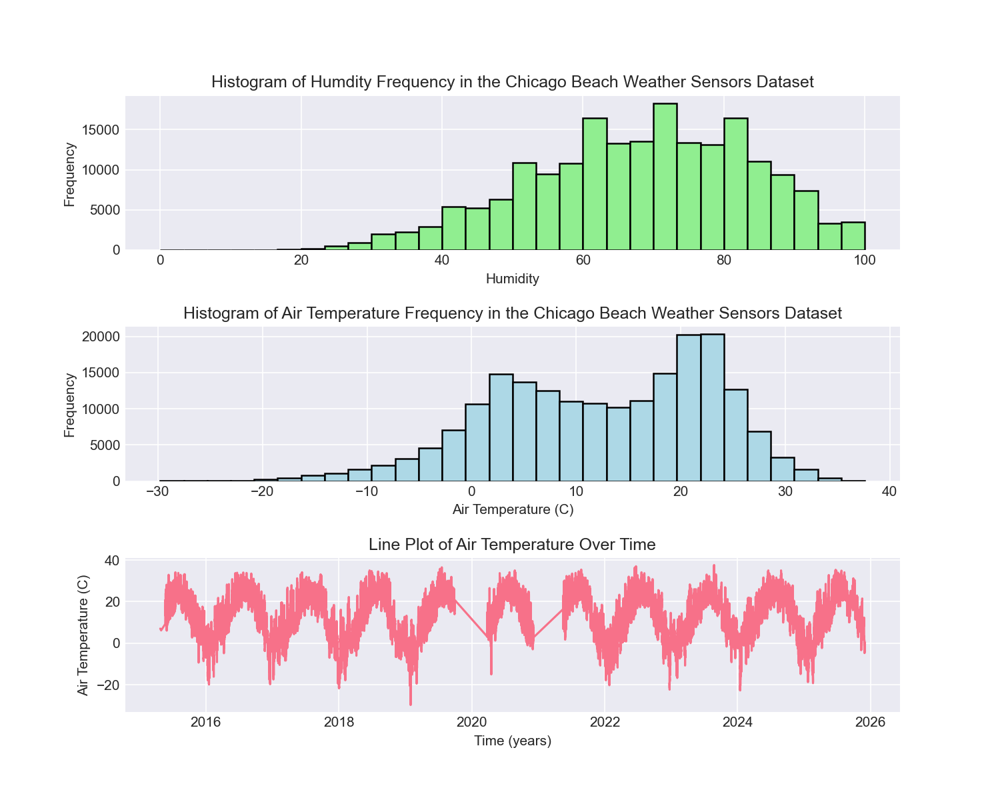
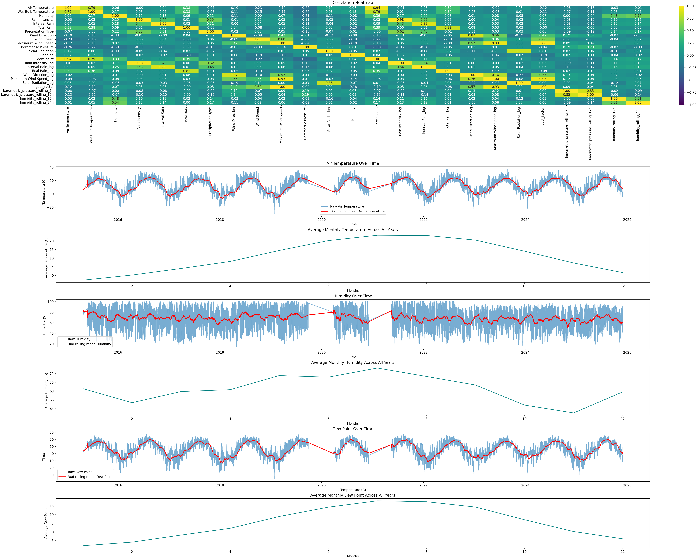

# Chicago Beach Weather Sensor Analysis

## Executive Summary
The dataset being analyzed is the Chicago Weather Sensor Dataset. This has roughly 10 years of data from 3 different weather sensors across Chicago, and measures various meteorological metrics over time. The main goal that I had going into this was to use the raw data to develop a metric relevant to public safety. I figured that the dew point temperature is important to track because this is the point at which the air becomes foggy depending on the air temperature and the humidity percentage. Predicting foggy conditions would provide valuable information to Chicago citizens, helping them better prepare for driving and other activities in potentially hazardous weather conditions. After testing different models, I found that using a random forest model to predict dew point yields a strong predictive performance.

## Phase-by-Phase Findings

### Phase 1-2: Exploration

In this phase, I performed the initial inspection of the data. Here are some things that were found:
- The original dataset had 196,138 rows
- Columns with 75,859 missing values
    - Wet Bulb Temperature
    - Rain Intensity
    - Total Rain
    - Precipitation Type
    - Heading
- Other rows had very minimal missing values < 5% of all data
    - Air Temperature
    - Barometric Pressure

Visualizations for data exploration:

- Humidity histogram
    - Normal distribution
- Air Temperature histogram
    - Normal distribution
- Air Temperature line plot over time
    - Obvious seasonal pattern shown

From here, the data that I would be using for the dew point calculation look good, moving onto the cleaning process. 

### Phase 3: Data Cleaning

The goal of the cleaning section was to have consistent data types, handle missing values, and correct for outliers.

Data types:
- Measurement Timestamp converted to datetime
- Precipitation Type is a categorical variable, converted to 0-3 and if necessary would be handled as a categorical variable in the modeling stage

Handling missing data:
- Missing data was handled differently depending on the proportion missing in each column
    - The columns mentioned above with 75,859 missing values were forward filled using the previous, non-missing, observation.
    - Barometric Pressure and Air Temperature had so few missing records so I made the decision to drop these rows outright, which is valid on columns with <5% of the values missing.
- This strategy preserved the time series structure while retaining valid data for the analysis.

Handling and removing outliers:
- Several variables contained unrealistic values that were corrected using upper and lower bounds based on meteorological reasoning:
    - Rain Intensity was clipped to a minimum of 0 and a maximum of 5.
    - Interval Rain was clipped between 0 and 25.
    - Solar Radiation was clipped between 0 and 1100.
    - Wind Speed was clipped between 0 and 18.
    - Maximum Wind Speed was clipped between 0 and 24.
    - Barometric Pressure was clipped between 800 and 1050.
- This ensured that all values used in modeling remained within realistic environmental limits.

### Phase 4: Data Wrangling 

After cleaning the data, I extracted temporal information about the dataset from the Measurement Timestamp to support time series data analysis. Since weather data is time dependent and seasonal, it is a good idea to look at such predictors over time windows to see their characteristics and trends.

These temporal features were created using the Measurement Timestamp column:
 - hour: hour of the day (0-23)
 - day_of_week: numeric day (0-6)
 - month: numeric month
 - year
 - day_name: Monday - Sunday
 - is_weekend: binary variable indicating weekend (0,1)

Additionally, the overall datetime range was also summarized by using the earliest and latest Measurement Timestamp records to find the total duration of this dataset. 

### Phase 5: Feature Engineering

Building on the cleaned data and temporal features, new features were created to use as predictors in the upcoming models. These features were designed to summarize trends over time, reduce skewness in the data, and create new trackable metrics that are not apparent in the raw measurements:
- dew_point: using the Magnus-Tetens formula we can use Air Temperature and Humidity, along with formula constants, to calculate the temperature where air becomes saturated with water vapor and condensation begins, which causes fog.
- gust_factor: dividing the Maximum Wind Speed by the median Wind Speed, this calculates how much stronger the maximum wind is compared to the typical wind, indicating the intensity of gusts compared to normal conditions.
- rolling calculations:
    - barometric_pressure_rolling_7h
    - barometric_pressure_rolling_12h
    - humidity_rolling_12h
    - humidity_rolling_24h
      These features summarize changes over time windows to detect shifts in barometric pressure or humidity that may affect weather conditions.
- log transformations were applied to all skewed columns to reduce right skewness and postentially improve model performance.
- log transformations:
  - Rain Intensity_log
  - Interval Rain_log
  - Total Rain_log
  - Wind Direction_log
  - Maximum Wind Speed_log
  - Solar Radiation_log

     - log transformations were applied to all skewed columns to reduce right skewness and postentially improve model performance.
     - Both original and log transformation columns were kept to not lose out on any predictor variables. After the log variables were created, the mean and median were checked to confirm that distribution was fixed.

Feature engineering visuals

- Calculating the pearson coefficient (R)

### Phase 6: Pattern Analysis

### Phase 7: Modeling Preparaton

### Phase 8: Modeling

### Phase 9: Results

## Visualizations
- *include at least 5 figures with captions*

## Model Results
- and interpretations of what the results mean

## Time Series Patterns

## Limitations and Next Steps